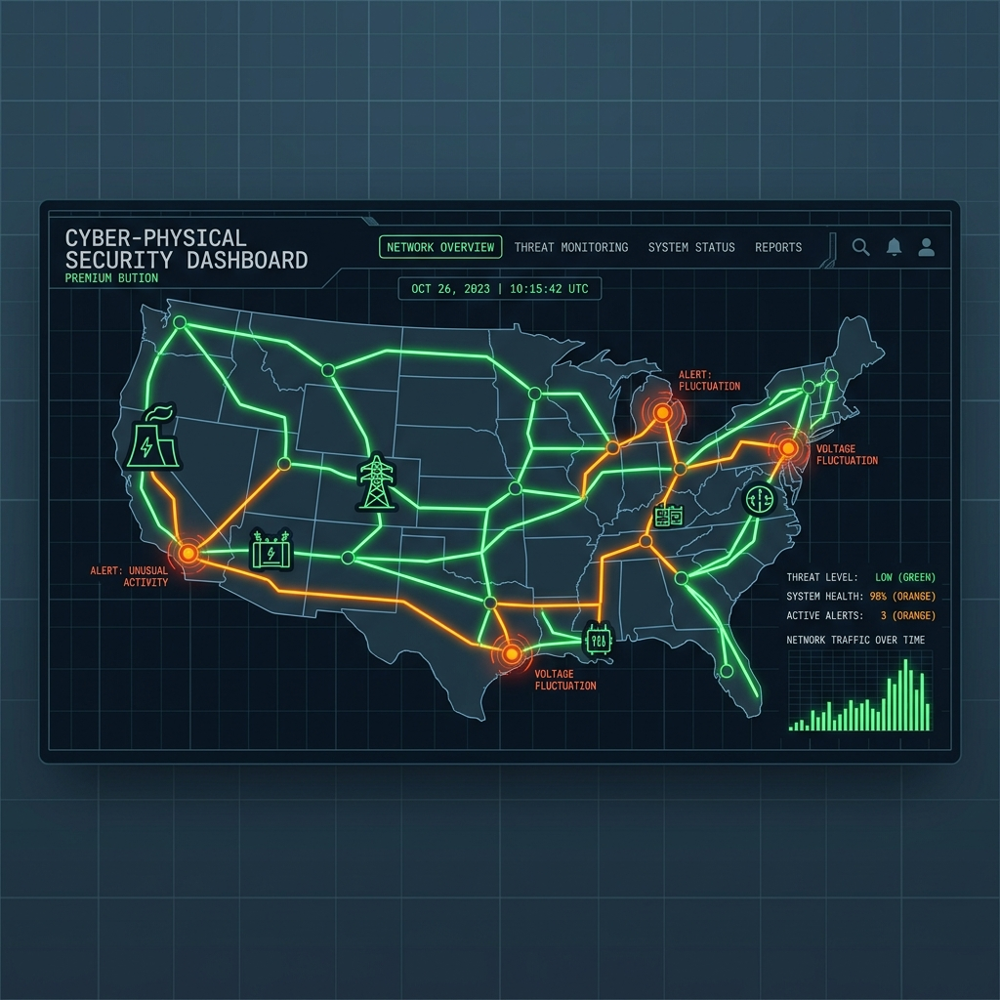

<h1 align="center"><b>TwinSec</b></h1>

<p align="center">
  
</p>

<p align="center">
  
  
  
  
  
  
  
</p>

<p align="center">
  <b>TwinSec</b> is a full-stack cyber-physical simulation platform and OT threat intelligence laboratory. Built for industrial security researchers, SCADA engineers, and SOC operators, it combines low-level protocol decoders, real-time differential physics math modeling, automated SIEM/Sigma detection compiling, multi-provider AI threat narration, and interactive Kali CLI control rooms to rehearse incident containment across critical infrastructure sectors.
</p>

---

## ⚡ Real System Architecture & Core Pillars

TwinSec operates as a **TanStack Start (React 19 + SSR)** web application backed by an immutable SQLite database (`twinsec.db`) and a multi-provider server-side AI Gateway.

```
+-----------------------------------------------------------------------------------+
|                            TWINSEC CONTROL ROOM COCKPIT                           |
|  [Purdue L0-L3 Topology]  [Kali CLI Terminal]  [Explainable AI]  [Sigma Compiler]   |
+-----------------------------------------------------------------------------------+
                                         │  (Type-Safe RPCs via createServerFn)
                                         ▼
+-----------------------------------------------------------------------------------+
|                            TANSTACK START SERVER ENGINE                           |
|  [auth.server.ts]   [ai-providers.server.ts]   [training.functions.ts] [health.ts] |
+-----------------------------------------------------------------------------------+
             │                                        │
             ▼                                        ▼
+-------------------------+              +------------------------------------------+
|  SQLITE (better-sqlite3)|              |       MULTI-PROVIDER AI GATEWAY          |
|  - operators            |              |  Groq 70B -> Gemini 1.5 -> Cerebras     |
|  - sessions             |              |  -> OpenRouter -> Local Ollama (Offline) |
|  - training_runs        |              +------------------------------------------+
|  - simulation_scenarios |
|  - audit_logs           |
+-------------------------+
```

---

## 🔍 Core Platform Capabilities

### 💻 1. Interactive Kali CLI Cyber Range Terminal (`KaliTerminal` & `TerminalFAB`)

Command the simulation range directly via an embedded, draggable Kali Linux terminal shell:

- **`scan [node_id]`**: Query SCADA topology nodes, protocol bindings, open ICS ports (Modbus 502, DNP3 20000, IEC-104 2404), and compromise states.
- **`isolate <node_id>`**: Quarantine infected PLC nodes from the SCADA network, drawing live quarantine rings (`oklch(0.7 0.25 230)`) on the topology canvas and halting cascade propagation.
- **`override <node_id>`**: Issue manual setpoint overrides to force nominal telemetry.
- **`patch <node_id>`**: Deploy PLC ladder logic attestation and firmware patches.
- **`status`**: Query live rotor velocity ($\text{Hz}$), bearing temperature ($\text{°C}$), and feeder pressure ($\text{bar}$).
- **`help` / `clear`**: Console command reference and log wiper.

### 🌐 2. 2D Interactive SCADA Topology Canvas (`Topology2D`)

- Displays 9 nodes across Purdue Model Layers 0–3 with animated telemetry arrows, active command pulses, and visual compromise/isolation rings.
- Supports 7 sector environments: **Power Grid** (`HOLLOW`), **Municipal Water** (`BASIN`), **Oil & Gas** (`SEVENTH BREATH`), **Smart Manufacturing** (`MISFIRE`), **Port Logistics** (`MANIFEST`), **Smart Buildings** (`DESIGO`), and **Smart City** (`CORRIDOR`).

### 🤖 3. Multi-Provider AI Gateway & Fallback Cascade

- Centralized in `src/lib/ai-providers.server.ts`.
- Automatically routes AI threat narration and espionage queries through a resilient failover cascade:
  1. **Groq Llama-3.3 70B** (Primary ultra-fast inference)
  2. **Google Gemini 1.5 Flash** (High-throughput fallback)
  3. **Cerebras Llama-3.3 70B** (Ultra-low latency inference)
  4. **OpenRouter AI Gateway** (Cloud multi-model provider)
  5. **Local Ollama** (Offline zero-network fallback)

### 🧠 4. Explainable AI Incident Narrator (`ExplainableAIPanel`)

- Generates natural-language causal reasoning and root-cause analysis for anomalies crossing Purdue Model layers, providing actionable mitigation recommendations for SOC analysts.

### 📝 5. Automated SIEM / Sigma Rule Exporter (`SigmaRuleExport`)

- Dynamically compiles downloadable `.yml` Sigma rules mapped to MITRE ATT&CK for ICS T-codes (`T0855`, `T0831`, `T0814`) to import directly into enterprise SIEMs like Splunk, Sentinel, or Elastic.

### 📰 6. CISA ICS-CERT Live Advisory Feed (`CISAThreatFeed`)

- Real-world CISA advisories linked directly to matching sector training scenarios in the range.

### 💾 7. Durable SQLite Database Persistence

- Built with **Drizzle ORM** and **better-sqlite3** running in Write-Ahead Logging (WAL) mode (`data/twinsec.db`).
- Tracks 5 relational tables: `operators`, `sessions`, `training_runs`, `simulation_scenarios`, and `audit_logs`.

---

## 🗄 Database Schema Overview

```typescript
// operators — User accounts with callsign, clearance, and bcrypt hashes
// sessions — HttpOnly cookie sessions with 7-day expiry
// training_runs — Complete drill outcomes, MW shed, MTTD/MTTR, decision history
// simulation_scenarios — Custom AI-generated cyber-physical attack scenarios
// audit_logs — Chronological audit logs for forensic timeline reconstruction
```

---

## 🚀 Running the Range Locally

### 1. Install Dependencies

```bash
npm install
```

### 2. Configure Environment Variables

Create a `.env` file in the project root:

```env
# AI Provider Keys (At least one required for AI features)
GROQ_API_KEY=gsk_your_groq_key_here
GEMINI_API_KEY=AIzaSy_your_gemini_key_here
OPENROUTER_API_KEY=sk-or-v1_your_openrouter_key_here
CEREBRAS_API_KEY=csk_your_cerebras_key_here

# Local Offline Ollama Fallback (Optional)
OLLAMA_BASE_URL=http://localhost:11434
OLLAMA_MODEL=llama3
```

### 3. Run Development Server

```bash
npm run dev
```

Open [http://localhost:3000](http://localhost:3000) to launch the TwinSec control room.

### 4. Execute System Health Diagnostics Suite

Run the 4-layer system sanity checker:

```bash
npm run health
```

Validates SQLite database tables, 10 facility image assets, API key configurations, and production build dist output.

### 5. Production Build

```bash
npm run build
```

### 6. Formatting & Linting

```bash
npm run format
npm run lint
```

---

## 📚 Academic Research & Reference Grounding

TwinSec integrates structured threat intelligence frameworks documented in [RESEARCH_GROUNDING.md](file:///d:/PRJ-7/twinsec/RESEARCH_GROUNDING.md) and [digital-twin-security-reference.md](file:///d:/PRJ-7/twinsec/digital-twin-security-reference.md):

- **MITRE ATT&CK for ICS (TAXII 2.1 API)**: Standardized mapping of industrial tactics and techniques (`https://cti-taxii.mitre.org/taxii/`).
- **Operational Technology Cyber Attack Database (OTCAD)**: Catalog of historical ICS incidents (Stuxnet, Industroyer, TRITON, Maroochy Water).
- **HAI (HIL-augmented ICS) Security Dataset**: Multi-stage industrial telemetry normalization schema.

---

## 🎓 Academic Viva Evaluation Guide

Use these key checkpoints during final evaluation:

1. **Demonstrate Kali CLI Isolation**: Open the CLI terminal (`CLI` button at bottom right), type `scan`, then `isolate plc-3` to quarantine the node and halt cascade propagation.
2. **Explain Physics Math Engine**: Show how rotor speed $\omega(t)$ and bearing temperature $T(t)$ respond dynamically to operator decisions.
3. **Show AI Failover Cascade**: Explain how `ai-providers.server.ts` routes requests across Groq, Gemini, Cerebras, OpenRouter, and local Ollama.
4. **Generate SIEM Sigma Rules**: Export a `.yml` Sigma detection rule from Section 04.
5. **Run CLI System Health Test**: Execute `npm run health` to demonstrate 100% database, asset, and build integrity.

---
