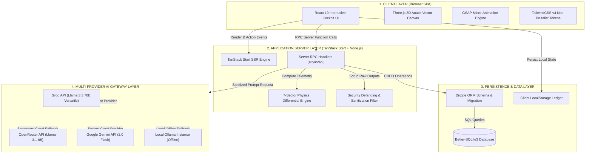

# 01. High-Level System Architecture Diagram

This document contains the formal **Mermaid System Architecture Diagram** for the **TwinSec Cyber-Physical Range & Incident Simulation Platform**.

## System Architecture (Mermaid)

## Layer Descriptions

1. **Client Layer:** Renders the neo-brutalist user interface using React 19, Three.js 3D Canvas visualizers, and GSAP micro-animations.
2. **Application Server Layer:** Executes server-side rendering, type-safe RPC endpoints, physics differential equation evaluation, and regex payload defanging.
3. **Persistence Layer:** Manages relational user accounts, session cookies, training runs, and audit event logs via Drizzle ORM and Better-SQLite3.
4. **Multi-Provider AI Gateway Layer:** Directs LLM prompts across Groq, OpenRouter, Gemini, and Ollama with an 8-second timeout cap and fallback failover logic.
