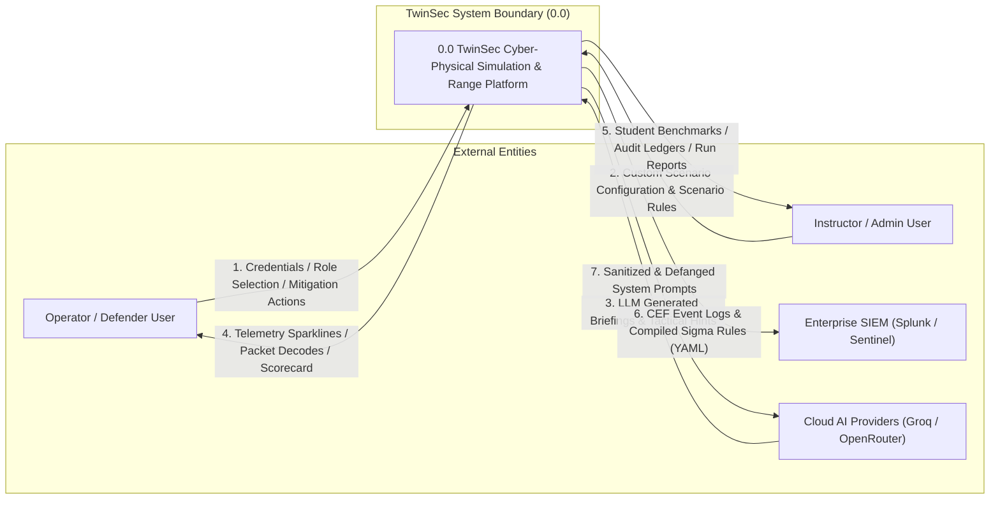

# 02. Data Flow Diagram — Level 0 (Context Diagram)

This document contains the **Level 0 Context Data Flow Diagram (DFD)** for the **TwinSec Platform**.

## DFD Level 0 Context Diagram (Mermaid)

## Entity Descriptions

- **Operator / Defender User:** Interacts with the cockpit, triggers node scans, applies containment actions (`ISOLATE`, `PATCH`, `TRIP`), and views debrief scorecards.
- **Instructor / Admin User:** Manages custom simulation scenarios, monitors student audit logs, and exports aggregate training metrics.
- **Enterprise SIEM:** Ingests Common Event Format (CEF) logs and Sigma rules generated during containment drills.
- **Cloud AI Providers:** Receives scrubbed operational prompts and returns defanged role briefings and hints.
