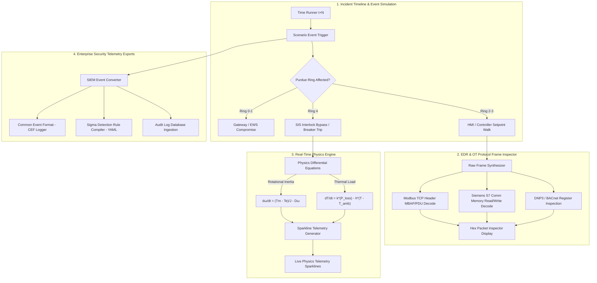

# 02. EDR & OT Telemetry Pipeline Diagram

This diagram details how **TwinSec** ingests raw operational network events, parses OT protocol headers, updates differential physics engines, and outputs security telemetry (CEF, Sigma Rules, SIEM Logs).

## Pipeline Flowchart



## Telemetry Export Formats

### 1. CEF Log Structure

```text
CEF:0|TwinSec|CyberRange|1.0|T0858|Program State Change|8|src=10.0.3.4 dst=10.0.3.50 act=WRITE_REGISTER msg="Modbus function 0x06 setpoint modified on PLC-3"
```

### 2. Sigma Rule Output Sample

```yaml
title: Unauthorized OT PLC Rung Logic Modification
id: 9a4f21b8-2940-4e31-8f1d-twinsec001
status: experimental
description: Detects unauthorized Modbus Write Multiple Registers (0x10) to Ring 3 PLCs
logsource:
  category: ot_network
  product: modbus
detection:
  selection:
    FunctionCode: 16
    UnitID: 1
    RegisterAddress: 40001
  condition: selection
falsepositives:
  - Authorized engineering maintenance window
level: critical
```
