# 03. Data Flow Diagram — Level 1 (Detailed Process Decomposition)

This document contains the **Level 1 Detailed Process Data Flow Diagram (DFD)** showing sub-process decomposition, data stores, and data flows.

## DFD Level 1 Detailed Process Diagram (Mermaid)

```mermaid
flowchart TD
    subgraph Entities ["External Entities"]
        User["Operator / User"]
        SIEM["Enterprise SIEM"]
        AIProvider["AI Provider Services"]
    end

    subgraph DataStores ["Data Stores"]
        D1[("D1: Operators Table")]
        D2[("D2: Sessions Table")]
        D3[("D3: Training Runs Table")]
        D4[("D4: Audit Logs Table")]
        D5[("D5: LocalStorage Ledger")]
    end

    subgraph Level1Processes ["Level 1 Sub-Processes"]
        P1["1.0 User Authentication & Session Management"]
        P2["2.0 Scenario Controller & Time Runner Engine"]
        P3["3.0 OT Packet Inspector & Dissector"]
        P4["4.0 Dynamic Physics Differential Calculator"]
        P5["5.0 AI Gateway & Security Defanging Scrubber"]
        P6["6.0 Evaluation Engine & SIEM Log Exporter"]
    end

    %% Process 1.0 Auth
    User -->|"Callsign & Password"| P1
    P1 -->|"Read/Write User Credentials"| D1
    P1 -->|"Issue Session Token"| D2
    P1 -->|"Auth Status & Badge ID"| User

    %% Process 2.0 Scenario & Time Runner
    User -->|"Sector Selection & Scrub Controls"| P2
    P2 -->|"Current Time t & Active Phase"| P3
    P2 -->|"Active Node Compromise State"| P4

    %% Process 3.0 Packet Inspector
    P3 -->|"Raw Modbus/S7 Hex Frames"| User

    %% Process 4.0 Physics Calculator
    P4 -->|"Rotor Speed & Bearing Temp Sparklines"| User

    %% Process 5.0 AI Gateway
    User -->|"Request Briefing / Hint"| P5
    P5 -->|"Scrubbed Prompt Request"| AIProvider
    AIProvider -->|"Raw LLM Response"| P5
    P5 -->|"Log AI Event"| D4
    P5 -->|"Defanged Briefing Dossier"| User

    %% Process 6.0 Evaluation & Exporter
    User -->|"Submit Decision Intervention"| P6
    P6 -->|"Save Completed Training Run"| D3
    P6 -->|"Persist Run Metadata"| D5
    P6 -->|"CEF Event Stream & Sigma Rules"| SIEM
    P6 -->|"Render Debrief Scorecard"| User
```

## Sub-Process Inventory

| Process ID | Process Name          | Ingested Data                     | Output Data                           | Primary Data Stores                   |
| ---------- | --------------------- | --------------------------------- | ------------------------------------- | ------------------------------------- |
| **1.0**    | Auth & Session        | Callsign, Password, Session Token | Auth Cookie, Clearance Level          | D1 (Operators), D2 (Sessions)         |
| **2.0**    | Scenario Controller   | Sector ID, Timeline Scrub Actions | Node States, Triggered Events         | Memory State                          |
| **3.0**    | Packet Inspector      | Event Tag, Node Protocol          | Hex Dump, Decoded PDU Fields          | Memory Mapping                        |
| **4.0**    | Physics Calculator    | Time $t$, Mitigation Multipliers  | $\omega(t)$ Speed, $T(t)$ Temperature | Memory Calculation                    |
| **5.0**    | AI Gateway & Defanger | Prompt Request, Role Context      | Defanged Dossier, Sanitized Hints     | D4 (Audit Logs)                       |
| **6.0**    | Evaluation & Exporter | User Decisions (`ACT`/`DEFER`)    | Scorecard, CEF Logs, Sigma Rules      | D3 (Training Runs), D5 (LocalStorage) |
