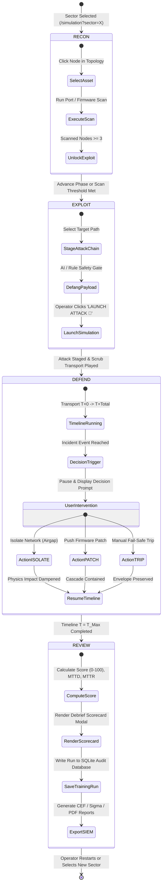

# 03. Simulation Phase State Machine Diagram

This document models the state transitions and execution lifecycle of the **TwinSec Simulation Engine** (`src/routes/simulation.tsx`).

## State Machine Diagram

## Phase Summary Table

| Phase       | Cell Mode  | Primary Operator Action                                                         | Key State Transitions                                        |
| ----------- | ---------- | ------------------------------------------------------------------------------- | ------------------------------------------------------------ |
| **RECON**   | Red Cell   | Scan Purdue Ring 0–1 nodes, discover open ports and OT protocols                | `scannedNodes.size >= 3` → Unlocks Exploit Stage             |
| **EXPLOIT** | Red Cell   | Stage attack vector against Ring 3 controllers and Ring 4 SIS                   | `defangPayload()` → Transition to DEFEND mode                |
| **DEFEND**  | Blue Cell  | Monitor physics sparklines, apply containment mitigations on event triggers     | `defMitigations[nodeId]` → Adjust `physicsMul` multiplier    |
| **REVIEW**  | Evaluation | Inspect debrief scorecard, review MTTD/MTTR metrics, export CEF/Sigma artifacts | `saveTrainingRun()` → Ingest run into SQLite `training_runs` |
