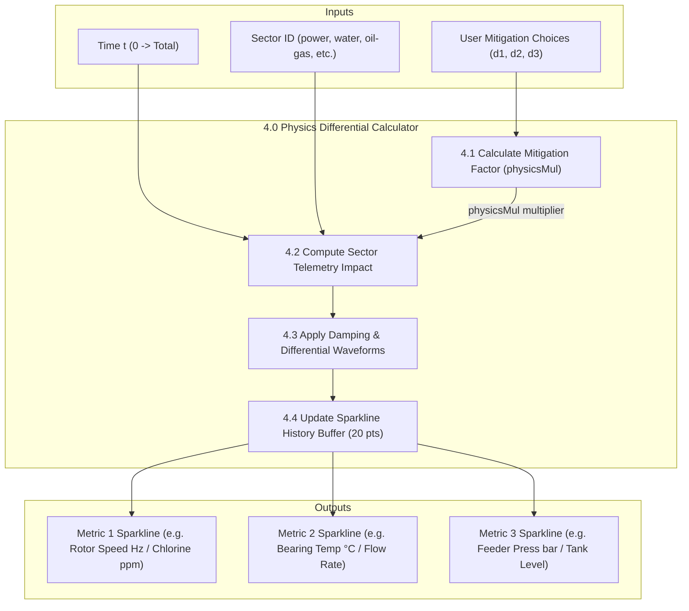
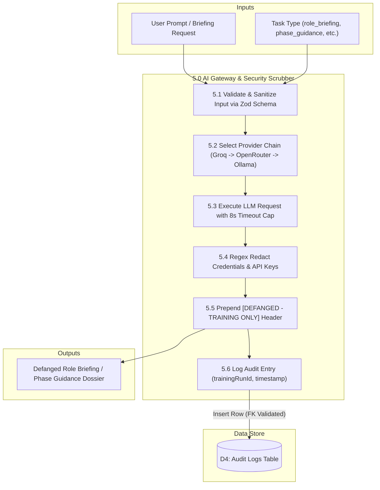

# 04. Data Flow Diagram — Level 2 (Sub-Process Decomposition)

This document details the **Level 2 Sub-Process Breakdown (DFD Level 2)** for two core systems:

1. **Sub-Process 4.0:** Dynamic Physics Differential Calculator
2. **Sub-Process 5.0:** AI Security Scrubber & Defanging Pipeline

---

## 1. DFD Level 2 — Physics Engine (Sub-Process 4.0)

---

## 2. DFD Level 2 — AI Gateway & Defanging Scrubber (Sub-Process 5.0)

