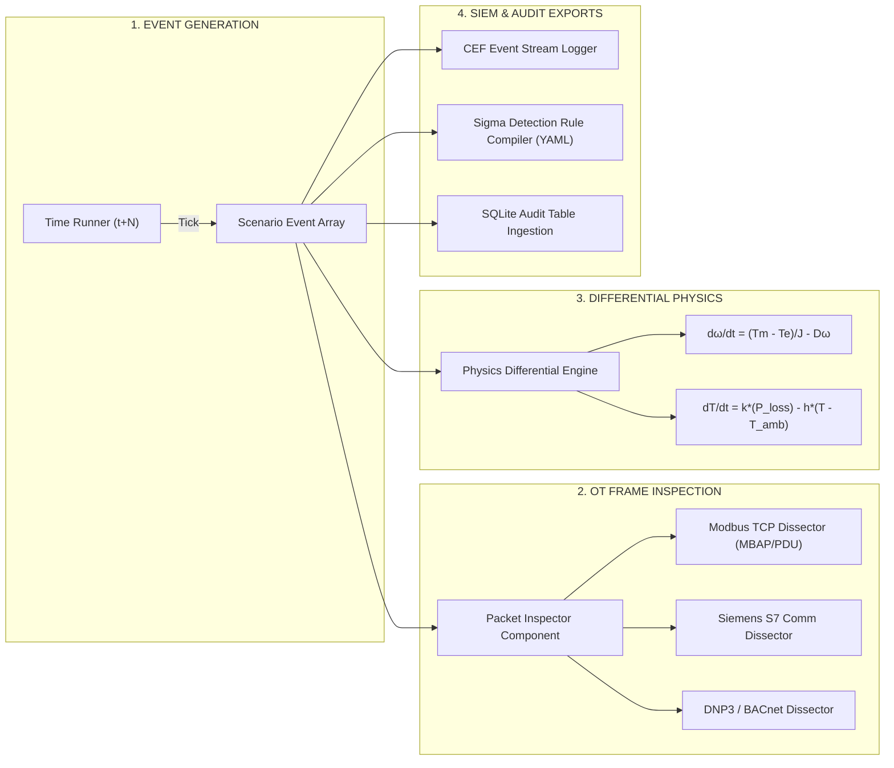

# 05. EDR & OT Telemetry Pipeline Diagram

This document contains the **End-to-End EDR Telemetry & OT Packet Inspection Pipeline Diagram (Mermaid)** for **TwinSec**.

## EDR & Telemetry Ingestion Pipeline (Mermaid)



## Protocol Frame Decode Structure

```text
+-------------------------------------------------------------------------------+
| MODBUS TCP FRAME STRUCTURE                                                   |
| +-------------------------+-----------------------+-------------------------+ |
| | Transaction ID (2 bytes) | Protocol ID (2 bytes) | Length Field (2 bytes)  | |
| +-------------------------+-----------------------+-------------------------+ |
| | Unit ID (1 byte)        | Function Code (1 byte)| Data Payload (N bytes)  | |
| +-------------------------+-----------------------+-------------------------+ |
+-------------------------------------------------------------------------------+
```
