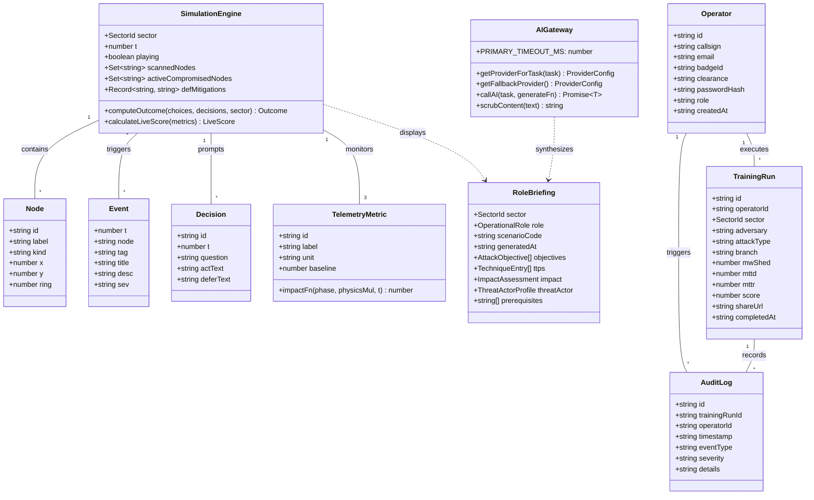

# 06. UML Class & Module Structure Diagram

This document models the object-oriented structure, interfaces, server functions, and data schemas for **TwinSec** using a **Mermaid Class Diagram**.

## UML Class Diagram (Mermaid)

## Module Responsibilities

1. **`SimulationEngine`**: Core state orchestrator (`src/routes/simulation.tsx`) managing timeline playback, decision evaluation, and live scoring.
2. **`TelemetryMetric`**: Registry defining 3 physics metrics per sector (`src/data/sector-telemetry.ts`).
3. **`AIGateway`**: Multi-provider wrapper managing timeouts, provider switching, and output defanging (`src/lib/ai-providers.server.ts`).
4. **`Operator` / `TrainingRun` / `AuditLog`**: Relational database models backed by Drizzle ORM (`src/lib/db/schema.ts`).
