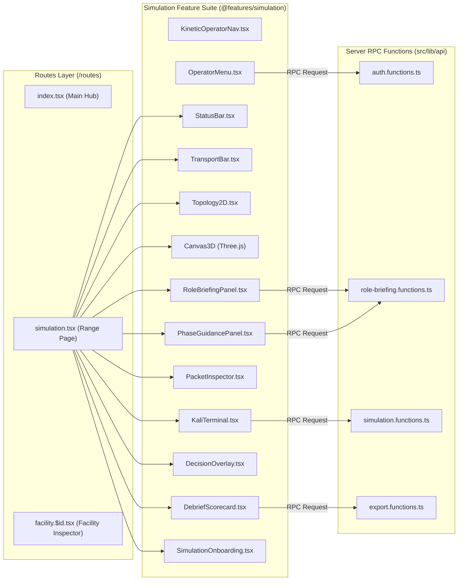

# 07. Component Architecture & Data Flow Diagram

This document models the frontend component hierarchy and client-to-server data flow across the application (`src/routes/simulation.tsx` and `@features/simulation`).

## Component Hierarchy & Data Flow

## Data Flow Protocol

1. **State Initialization**: When `/simulation?sector=water` mounts, `getScenarioData("water")` populates nodes, edges, events, and decisions into React state.
2. **Time Scrubbing**: Moving the `TransportBar` slider updates `t` state, triggering `activeIdx` search in scenario events.
3. **Topology Rendering**: `Topology2D` computes SVG node positions and edge line SVG paths, applying color highlights (`oklch`) based on node status (`NOMINAL`, `DRIFT`, `COMPROMISED`, `ISOLATED`).
4. **Packet Inspection**: Clicking any active network edge opens `PacketInspector`, which decodes raw Modbus TCP or Siemens S7 bytes dynamically based on event tags.
5. **Mitigation Interventions**: Executing an action (`ISOLATE`, `PATCH`, `TRIP`) updates `defMitigations` map, recalculates `choices` via ring-level analysis, and updates physics differential equations.
