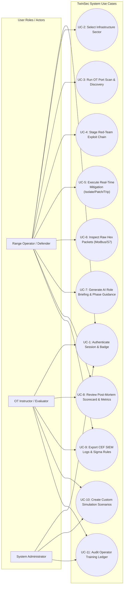

# 07. Use Case Diagram

This document contains the **System Use Case Diagram (Mermaid)** mapping primary user roles (Range Operator, Instructor, System Administrator) to core system capabilities.

## Use Case Diagram (Mermaid)

## Actor & Use Case Summary

| Actor              | Key Objectives                                              | Primary Interactions                                                                                                 |
| ------------------ | ----------------------------------------------------------- | -------------------------------------------------------------------------------------------------------------------- |
| **Range Operator** | Practice incident containment, minimize MW shed & MTTD/MTTR | Scans topology nodes, executes defense interventions, inspects raw Modbus/S7 hex frames, downloads debrief dossiers. |
| **OT Instructor**  | Evaluate operator readiness, design custom OT cyber drills  | Creates custom scenarios (`simulationScenarios`), audits student performance logs, exports CEF telemetry.            |
| **System Admin**   | Maintain range availability, manage database tables         | Manages SQLite database schemas, monitors session validity, verifies AI Gateway provider configurations.             |
