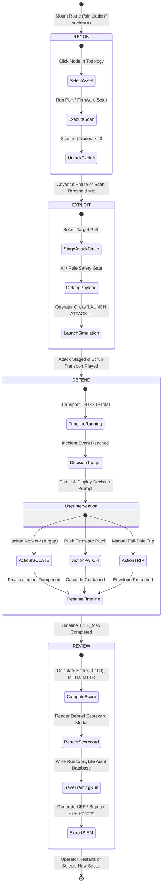

# 08. Simulation Phase State Machine Diagram

This document models the state transitions and execution lifecycle of the **TwinSec Simulation Engine** (`src/routes/simulation.tsx`).

## State Machine Diagram (Mermaid)

