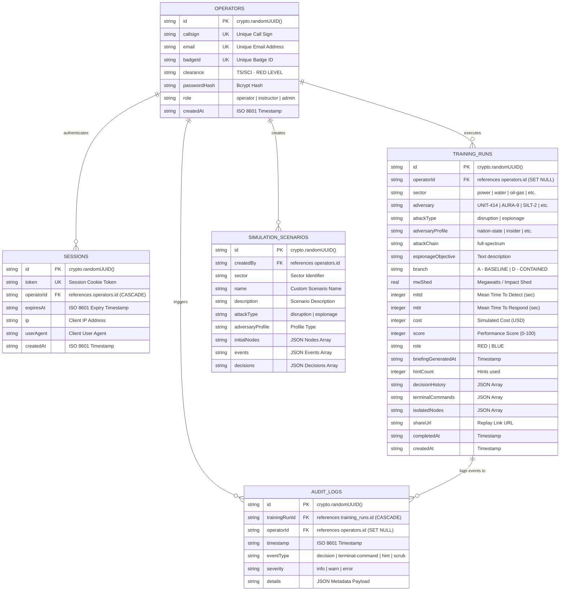

# 09. Entity-Relationship (ER) Database Schema Diagram

This document illustrates the database schema and table relationships for **TwinSec** backed by Drizzle ORM and Better-SQLite3 (`src/lib/db/schema.ts`).

## Entity-Relationship Diagram (Mermaid)

