# 10. AI Gateway & Security Defanging Sequence Diagram

This sequence diagram documents the **AI Gateway request lifecycle** (`src/lib/ai-providers.server.ts`), multi-provider failover routing, and safety defanging pipeline (`scrubContent()`).

## Sequence Diagram (Mermaid)

```mermaid
sequenceDiagram
    autonumber
    actor Operator as Client / Range UI
    participant ServerFn as TanStack Server Function
    participant Gateway as AI Gateway (callAI)
    participant PrimaryProvider as Primary AI Provider (Groq 70B)
    participant FallbackProvider as Fallback AI Provider (OpenRouter 8B)
    participant Defanger as Defanging & Safety Scrubber
    participant AuditDB as SQLite Audit Ledger

    Operator->>ServerFn: Request Briefing / Command (e.g. generateRoleBriefing)
    ServerFn->>Gateway: callAI(task, generateFn)

    Gateway->>Gateway: Inspect process.env & Select Provider Chain

    rect rgb(20, 30, 20)
        Note over Gateway,PrimaryProvider: Attempt Primary Provider (Groq Llama 3.3 70B)
        Gateway->>PrimaryProvider: withTimeout(generateFn(Groq), 8000ms)
        alt Primary Success (HTTP 200 OK)
            PrimaryProvider-->>Gateway: Raw Generated Text Payload
        else Primary Fails (HTTP 429 / 500 / Timeout 8s)
            PrimaryProvider-->>Gateway: Error / Timeout
            Gateway->>Gateway: Log Warning & Switch to Fallback
            Gateway->>FallbackProvider: withTimeout(generateFn(OpenRouter), 8000ms)
            FallbackProvider-->>Gateway: Raw Generated Text Payload
        end
    end

    Gateway->>Defanger: scrubContent(rawText)

    rect rgb(30, 20, 20)
        Note over Defanger: Defanging Operations
        Defanger->>Defanger: Insert Header: [DEFANGED - TRAINING ONLY]
        Defanger->>Defanger: Redact Private Keys / Auth Tokens
        Defanger->>Defanger: Defang Live IP Addresses & Domain Names
        Defanger->>Defanger: Convert Exploitation Commands to Illustrative Syntax
    end

    Defanger-->>Gateway: Clean & Defang Payload

    Gateway->>AuditDB: logAudit(trainingRunId, "ai-generation", metadata)
    AuditDB-->>Gateway: Ingestion Confirmed (FK Validated)

    Gateway-->>ServerFn: Return Defanged Response
    ServerFn-->>Operator: Render Response in Docket / Terminal UI
```

