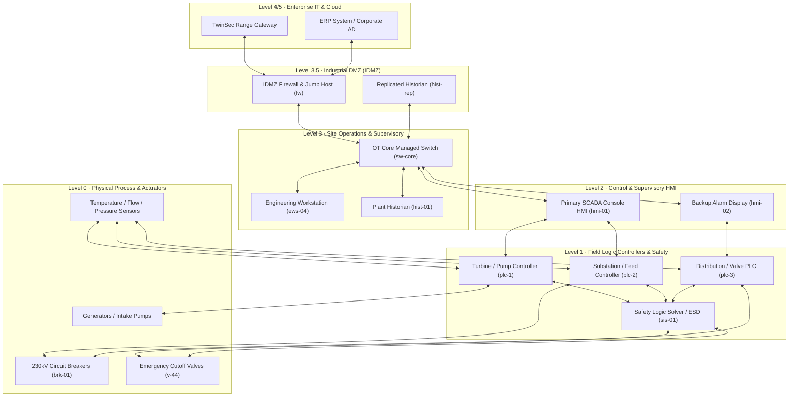

# 11. Purdue Model Industrial OT Network Topology Diagram

This document illustrates the 5-layer **Purdue Model Architecture** mapped across the 7 critical infrastructure sectors supported by TwinSec (`src/data/scenarios.ts`).

## Purdue Model Layer Mapping (Mermaid)

