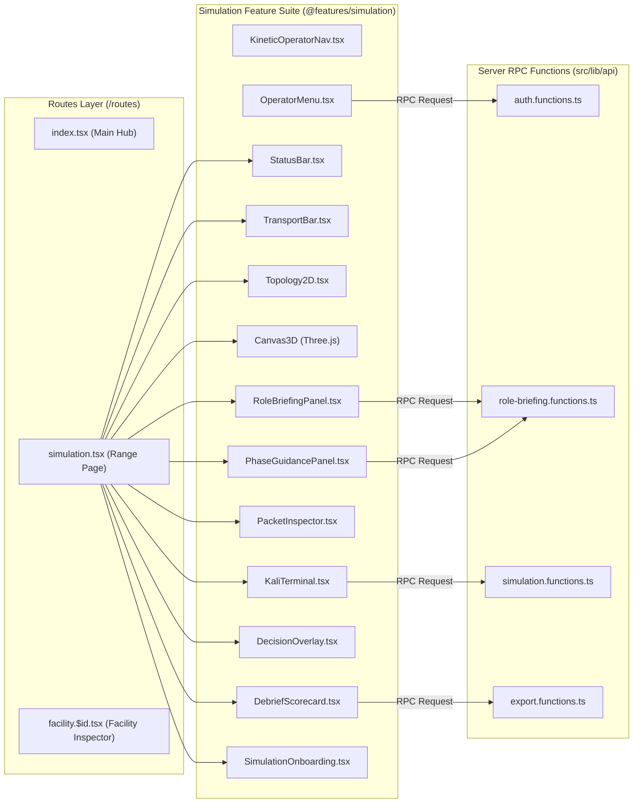

# 12. Component Architecture & Data Flow Diagram

This document models the frontend component hierarchy and client-to-server data flow across the application (`src/routes/simulation.tsx` and `@features/simulation`).

## Component Hierarchy & Data Flow (Mermaid)

