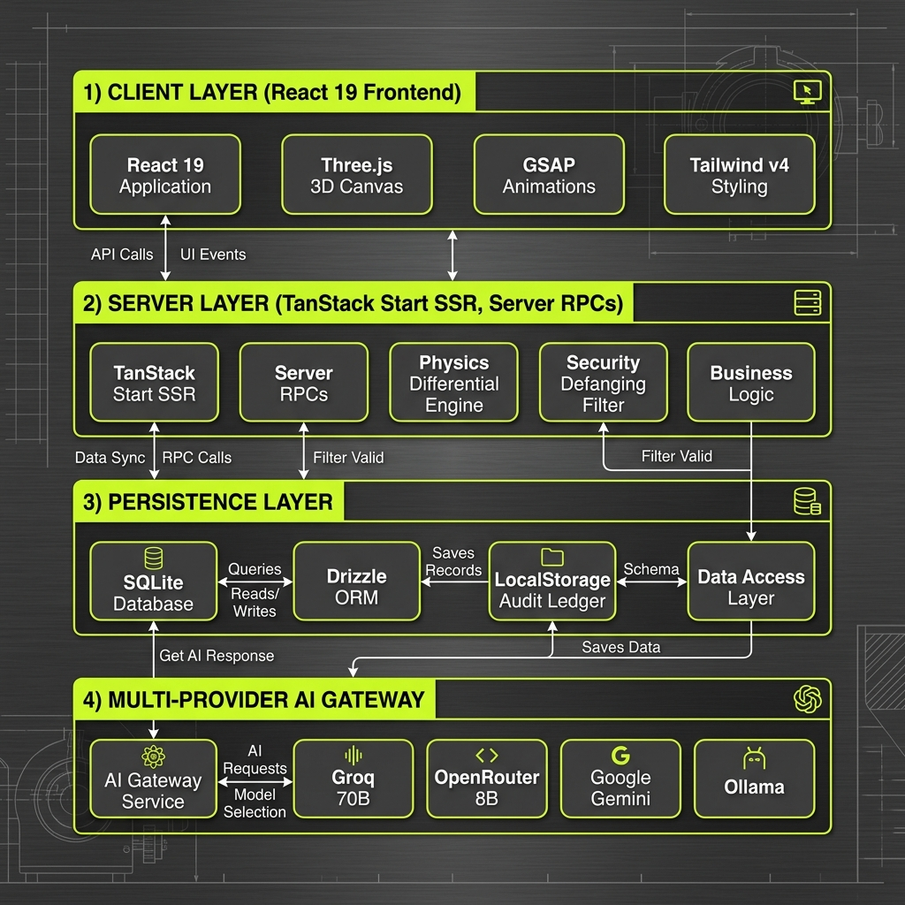
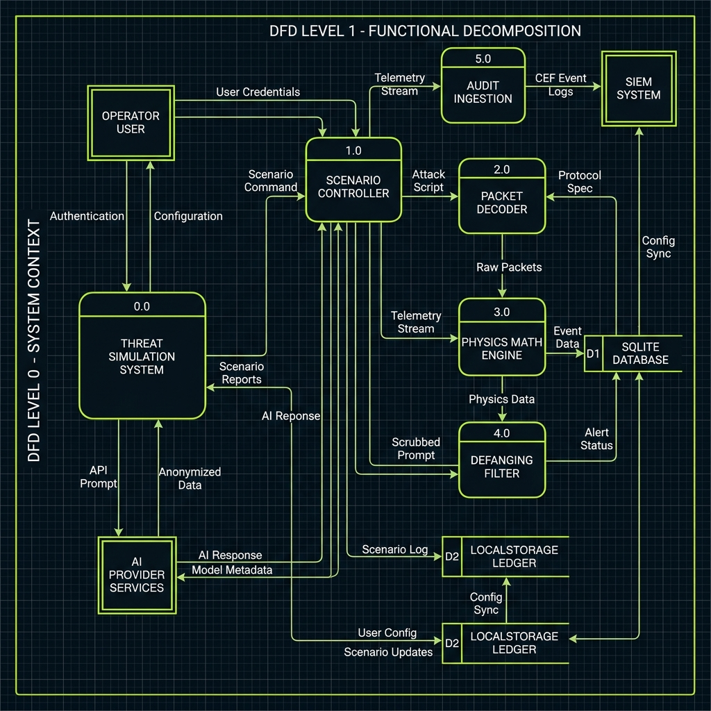
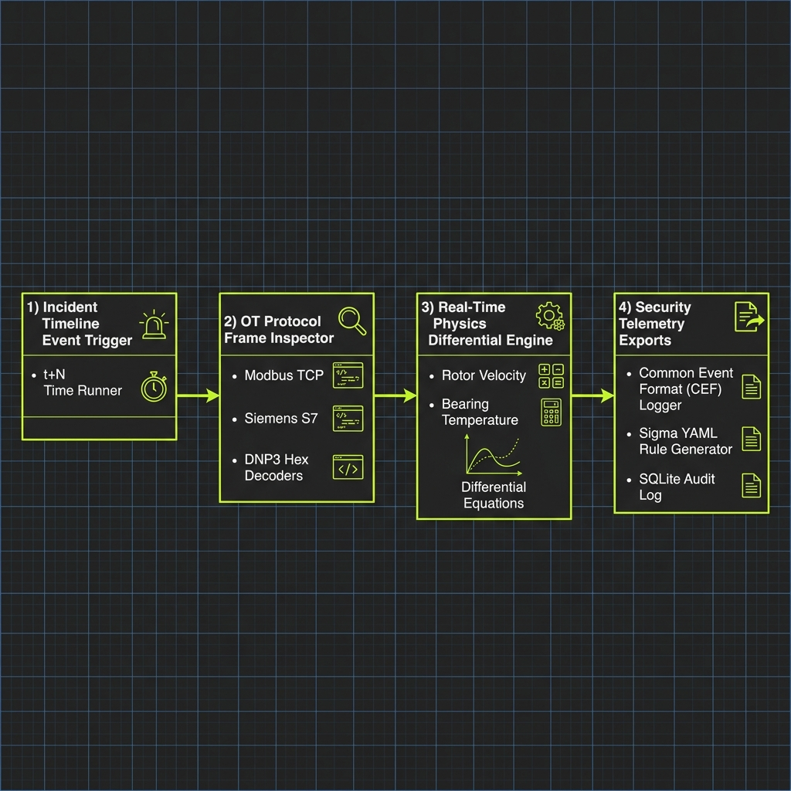
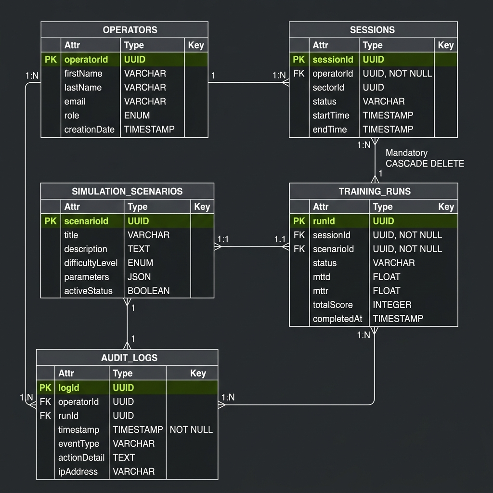
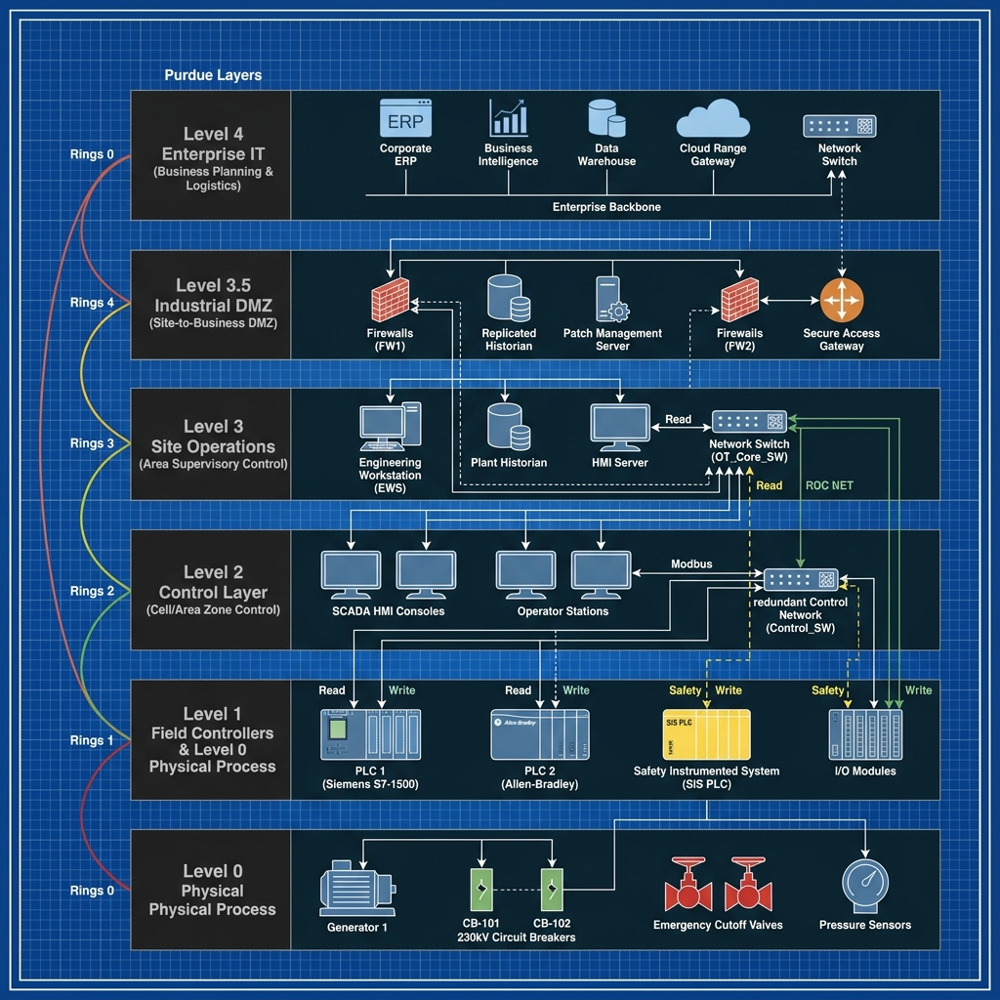
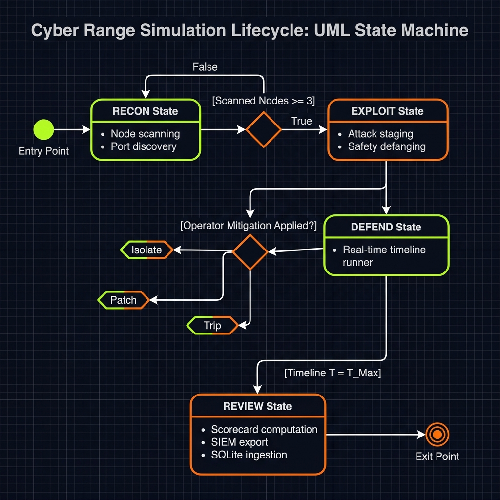
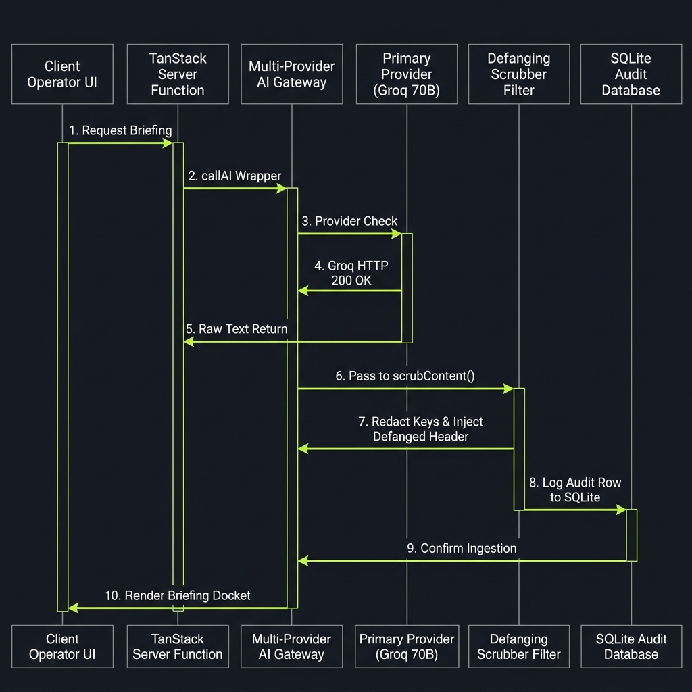
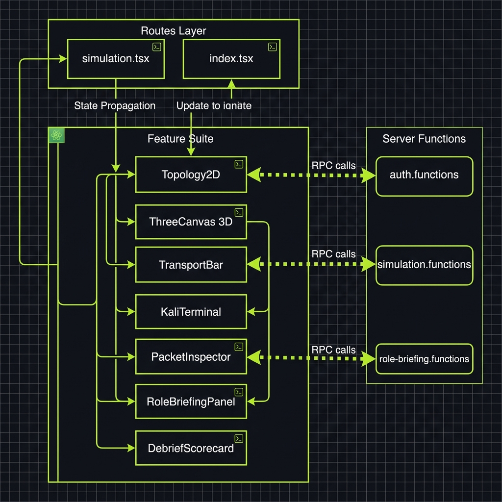

# 🖼 Draw.io Visual Software Engineering Diagrams Suite

This document contains a complete suite of **Draw.io style graphical diagrams** featuring vector boxes, directional flow arrows, color-coded node layers, and technical labels for academic project reports, whitepapers, and viva presentations.

---

## 1. High-Level System Architecture Diagram

> **Architectural Components:**
>
> - **Client Layer:** React 19 SPA, GSAP Animation Core, Three.js 3D Attack Canvas, Tailwind v4 design tokens.
> - **Server Layer:** TanStack Start SSR Engine, Server RPC Functions, Dynamic Physics Differential Engine, Security Defanging Scrubber.
> - **Persistence Layer:** Better-SQLite3, Drizzle ORM Schema, LocalStorage Audit Ledger.
> - **AI Gateway:** Multi-provider fallback chain (Groq Llama 3.3 70B, OpenRouter 8B, Google Gemini, Local Ollama).

---

## 2. Data Flow Diagram (DFD Level 0 & Level 1)

> **Data Flow Processes:**
>
> - **External Entities:** Operator User, SIEM Endpoint, AI Provider Services.
> - **Processes:** `1.0 Scenario Controller`, `2.0 Packet Decoder`, `3.0 Physics Math Engine`, `4.0 Defanging Filter`, `5.0 Audit Ingestion`.
> - **Data Stores:** `D1: SQLite Database`, `D2: LocalStorage Ledger`.

---

## 3. EDR & OT Telemetry Data Pipeline Diagram

> **Telemetry Pipeline Stages:**
>
> 1. **Incident Timeline Event Trigger:** $t+N$ Time runner advancing scenario events.
> 2. **Packet Frame Inspector:** Decodes Modbus TCP (MBAP/PDU), Siemens S7 Comm, DNP3, and BACnet headers.
> 3. **Real-Time Physics Differential Engine:** Graphs rotational velocity $\omega(t)$ and thermal load $T(t)$.
> 4. **Enterprise Telemetry Exports:** Emits CEF SIEM logs, Sigma YAML rules, and SQLite audit rows.

---

## 4. Entity-Relationship (ERD) Database Schema Diagram

> **Database Entity Relationships:**
>
> - **`OPERATORS`** 1:N **`SESSIONS`** (Cascade Delete)
> - **`OPERATORS`** 1:N **`TRAINING_RUNS`** (Set Null)
> - **`TRAINING_RUNS`** 1:N **`AUDIT_LOGS`** (Cascade Delete)
> - **`OPERATORS`** 1:N **`SIMULATION_SCENARIOS`**

---

## 5. Purdue Model Industrial OT Network Topology Diagram

> **5-Layer Purdue Model Segmentation:**
>
> - **Level 4/5 (Enterprise IT):** Cloud Range Gateway, Corporate ERP.
> - **Level 3.5 (IDMZ):** Industrial DMZ Firewall & Replicated Historian.
> - **Level 3 (Operations Control):** Engineering Workstation (EWS), Plant Historian, OT Core Managed Switch.
> - **Level 2 (Control Level):** Primary SCADA HMI Consoles.
> - **Level 1 (Field Controllers):** PLCs & Safety Instrumented Systems (SIS).
> - **Level 0 (Physical Process):** Generators, 230kV Circuit Breakers, Emergency Cutoff Valves, Sensors.

---

## 6. Simulation Phase State Machine Diagram

> **Lifecycle State Transitions:**
>
> - **RECON State:** Node scanning & OT port discovery ($\ge 3$ nodes unlocks exploitation).
> - **EXPLOIT State:** Attack path staging, safety defanging via `scrubContent()`.
> - **DEFEND State:** Real-time timeline execution, decision trigger prompts (Isolate, Patch, Trip).
> - **REVIEW State:** Scorecard computation, MTTD/MTTR analytics, SIEM log export.

---

## 7. AI Gateway & Defanging Sequence Diagram

> **Sequence Execution Flow:**
>
> 1. Client requests briefing/command via Server Function.
> 2. `callAI()` inspects provider configuration.
> 3. Primary call (Groq Llama 3.3 70B) executes with 8-second timeout cap.
> 4. Raw response is passed to `scrubContent()` defanging filter.
> 5. Defanged payload logged to `audit_logs` table in SQLite.
> 6. Defanged docket rendered to operator UI.

---

## 8. React Component & Server RPC Data Flow Diagram

> **Component State & Data Flow:**
>
> - **Routes:** `simulation.tsx`, `index.tsx`, `facility.$id.tsx`.
> - **Feature Suite:** `Topology2D`, `ThreeCanvas 3D`, `TransportBar`, `KaliTerminal`, `PacketInspector`, `RoleBriefingPanel`, `DebriefScorecard`.
> - **Server RPCs:** `auth.functions`, `simulation.functions`, `role-briefing.functions`, `export.functions`.
