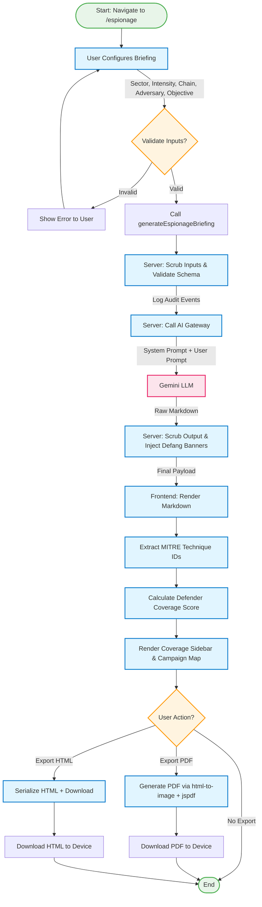
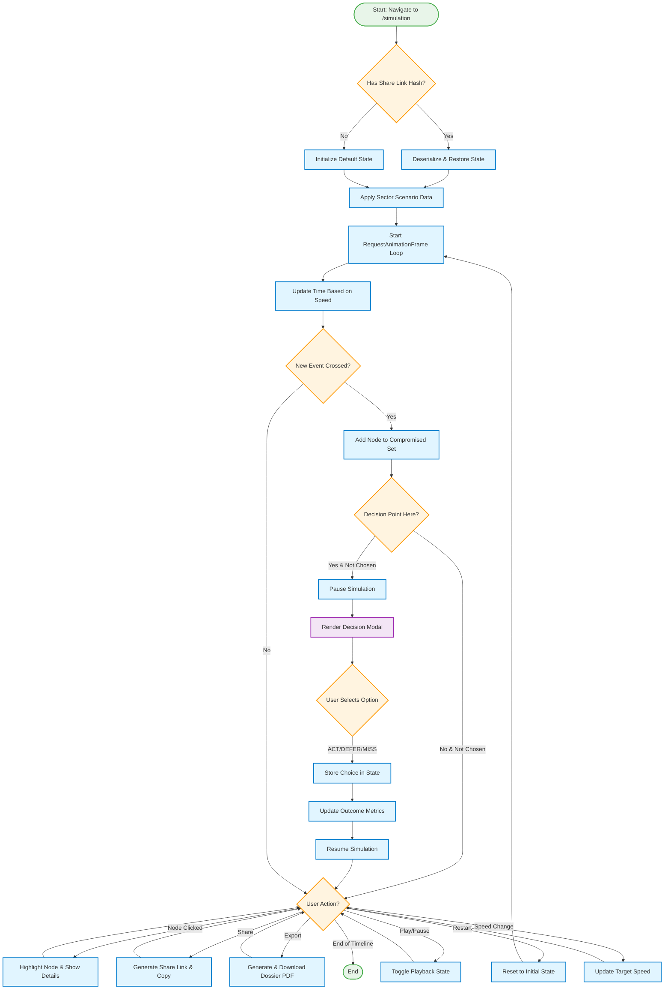

# TwinSec Process Flow Documentation

## Overview

This document details the core workflows in the TwinSec cyber-physical simulation platform, including step-by-step textual descriptions, stakeholder identification, and visual Mermaid flow diagrams.

---

## 1. Espionage Briefing Generation & Export Workflow

This flow generates AI-powered nation-state espionage threat briefings, scrubs inputs/outputs for safety, and exports results to PDF/HTML.

### Stakeholders

- **End User (Operator/Defender):** Configures briefing parameters and consumes the final output.
- **TwinSec Frontend (Espionage Page):** Renders the UI, handles input validation, and displays generated content.
- **TwinSec Server (Server Function):** Validates input, scrubs sensitive data, calls the AI gateway, and processes output.
- **OpenRouter (3rd Party):** Provides access to the LLM (Qwen3 Next) for generating briefings.

### Dependencies

- `OPENROUTER_API_KEY` environment variable
- `generateEspionageBriefing` server function
- `html-to-image` and `jspdf` libraries for export

---

### Textual Description of Steps

#### Step 1: User Configuration

1. User navigates to `/espionage` page
2. User selects target sector (power/water/oil-gas/manufacturing/port/smart-building/smart-city)
3. User selects intensity level (reconnaissance/intrusion/persistence/exfiltration/full-chain)
4. User selects chain preset (collection/infiltration/lateral-movement/disruption/full-spectrum)
5. User enters adversary label and objective, or selects from predefined presets

#### Step 2: Input Validation & Scrubbing (Frontend + Server)

1. Frontend validates inputs are non-empty and within allowed ranges
2. User clicks "▶ GENERATE DOSSIER" button
3. Frontend calls `generateEspionageBriefing` server function with parameters
4. Server-side: Zod schema validates input types
5. Server-side: Input scrubbing occurs:
   - Sensitive patterns (shellcode, private keys, AWS keys, curl pipe shells) are redacted
   - Control characters are stripped
   - Audit log entry created for each scrubbing action

#### Step 3: AI Briefing Generation

1. Server initializes AI gateway client with AI_GATEWAY_API_KEY
2. Server builds the system prompt (hard safety gates, MITRE ATT&CK for ICS mapping requirements, defender pairing rules)
3. Server builds user prompt with sector, adversary, objective, intensity, chain, and required phases
4. Server calls Gemini via AI gateway using Vercel AI SDK
5. LLM generates briefing content in Markdown format

#### Step 4: Output Processing & Scrubbing

1. Server receives raw LLM response
2. Server scrubs output:
   - Public routable IP addresses are replaced with RFC 5737 documentation ranges (203.0.113.X)
   - Sensitive patterns are redacted
   - Code blocks missing "illustrative" prefix get it injected automatically
   - All scrubbing actions are added to the audit log
3. Server returns final payload: markdown, sector, adversary, phases, audit log, timestamp

#### Step 5: Briefing Display & Coverage Analysis

1. Frontend receives payload
2. Frontend renders Markdown with custom components (code blocks, headers, etc.)
3. Frontend extracts MITRE technique IDs from markdown
4. Frontend calculates defender coverage score by matching extracted IDs against predefined coverage map
5. Coverage sidebar renders:
   - Overall coverage percentage
   - MITRE ID pills
   - Filterable defender control list (tactic filter, coverage gap filter)
6. Campaign map is rendered with interactive targets

#### Step 6: Briefing Export (Optional)

##### Option A: PDF Export

1. User clicks "⤓ EXPORT PDF"
2. Frontend uses `html-to-image` to capture dossier DOM as PNG
3. Frontend uses `jspdf` to generate PDF:
   - Cover page with exercise info
   - Topology snapshot
   - Incident log
   - Table of contents
4. PDF is downloaded to user's device

##### Option B: HTML Export

1. User clicks "⤓ EXPORT HTML"
2. Frontend serializes dossier DOM with embedded CSS
3. HTML file is downloaded to user's device

---

### Visual Flow Diagram



---

## 2. Simulation Exercise Workflow

This flow lets users run interactive cyber-physical incident simulations, make decisions at key points, and export results.

### Stakeholders

- **End User (Operator/Defender):** Interacts with simulation, makes decisions, and reviews outcomes.
- **TwinSec Frontend (Simulation Page):** Renders topology, event log, decision points, and outcome visualization.
- **Per-Sector Scenario Data:** Defines nodes, edges, events, and decision branches for each sector.

---

### Textual Description of Steps

#### Step 1: Initialization & Sector Selection

1. User navigates to `/simulation` (optionally with `?sector=...` query param)
2. Page checks for share link hash (`#s=...`)
   - If present: Deserialize and restore state (time, speed, choices, selected node)
   - If not present: Initialize default state (time=0, playing=true, speed=60x, no choices)
3. Apply sector-specific scenario:
   - Swap nodes/edges/events/decisions based on selected sector
   - Set exercise metadata (title, site, adversary, protocols)

#### Step 2: Simulation Playback

1. RequestAnimationFrame loop starts
2. Speed is eased smoothly for UX
3. Time increments based on current speed
4. Active event index is calculated based on current time
5. If a new event is crossed:
   - Update compromised nodes set
   - Trigger UI impact animations
   - Check for decision point at this timestamp
   - If decision point exists and user hasn't chosen yet: Pause simulation, show decision modal

#### Step 3: Decision Points

1. Simulation pauses at decision time
2. Decision modal renders:
   - Triggering event summary
   - Context/background
   - 3 options (ACT, DEFER, DO NOTHING/MISS)
   - Consequence preview for each option
3. User selects an option
4. Choice is stored in state
5. Simulation resumes playback
6. Outcome metrics are updated based on choice (MW shed, MTTD, MTTR, cost, branch)

#### Step 4: Topology & Node Interaction

1. User clicks or focuses a node in topology
2. Node is highlighted in topology view
3. Sidebar shows node details:
   - Label & kind
   - Vendor & firmware
   - Exposure level
   - Affected systems
4. Node interactions are recorded for share link

#### Step 5: Share & Export

##### Option A: Share Link

1. User clicks "Share" button
2. Frontend serializes state to JSON: time, speed, selected node, choices, last 20 interactions
3. JSON is base64 encoded and appended to URL as hash
4. URL is copied to clipboard
5. Toast notification confirms success

##### Option B: Export Dossier

1. User clicks "Export Dossier"
2. Simulation pauses
3. Frontend uses `html-to-image` to capture topology and frame
4. Frontend uses `jspdf` to generate multi-page PDF
5. PDF is downloaded

#### Step 6: Restart Simulation

1. User clicks "Restart" button
2. State is reset to initial conditions
3. Share link hash is cleared from URL
4. Simulation starts playing from time 0

---

### Visual Flow Diagram



---

## 3. Core User Journey: Home → Twin Engine → Facility → Simulation

This is the primary user flow for exploring facilities and launching exercises.

### Textual Description of Steps

1. **Landing on Home Page**
   - User visits `/`
   - Hero section animates in
   - User reads manifesto and browses attack surface

2. **Entering Twin Engine**
   - User clicks "ENTER TWIN ENGINE →" button
   - Navigates to `/twin-engine`
   - Facility index loads
   - Default selected: Oil & Gas (or first facility)

3. **Selecting a Facility**
   - User browses facility list (index sidebar)
   - User clicks a facility or uses arrow keys to navigate and Enter to select
   - Preview image animates in with GSAP
   - Facility metrics are displayed
   - Dependency graph highlights connections to selected facility

4. **Entering Facility Page**
   - User clicks "ENTER [SECTOR] →" button
   - Navigates to `/facility/[id]`
   - Living world topology renders
   - User can click nodes to inspect details
   - User reads attack scenarios

5. **Launching Simulation**
   - User clicks "LAUNCH EXERCISE →" from either Twin Engine or Facility page
   - Navigates to `/simulation?sector=[id]`
   - Sector-specific scenario loads
   - Simulation begins playing automatically

---

### Visual Flow Diagram

```mermaid
flowchart TD
    StartJourney([User Visits /]) --> HomeHero[Home: Hero & Manifesto]
    HomeHero --> HomeBrowse[Home: Browse Attack Surface & Scenarios]
    HomeBrowse --> ClickTwin{User Action?}
    ClickTwin --> |Click ENTER TWIN ENGINE| NavTwin[Navigate to /twin-engine]

    NavTwin --> TwinIndex[Twin Engine: Facility Index]
    TwinIndex --> SelectFacility[Select Facility via List/Arrow Keys]
    SelectFacility --> PreviewUpdate[Twin Engine: Update Preview & Metrics]
    PreviewUpdate --> ClickDepGraph{Click Dependency Graph Node?}
    ClickDepGraph --> |Yes| SelectFacility
    ClickDepGraph --> |No| ClickEnterFacility{Click ENTER [SECTOR]?}

    ClickEnterFacility --> |Yes| NavFacility[Navigate to /facility/[id]]
    ClickEnterFacility --> |No| ClickLaunchSimTwin{Click LAUNCH EXERCISE?}
    ClickLaunchSimTwin --> |Yes| NavSimTwin[Navigate to /simulation?sector=[id]]

    NavFacility --> FacilityTopo[Facility: Living World Topology]
    FacilityTopo --> ClickNode{Click Node?}
    ClickNode --> |Yes| ShowNodeDetails[Show Node Details Sidebar]
    ShowNodeDetails --> ClickNode
    ClickNode --> |No| ReadScenarios[Facility: Read Attack Scenarios]
    ReadScenarios --> ClickLaunchSimFacility{Click LAUNCH EXERCISE?}

    ClickLaunchSimFacility --> |Yes| NavSimFacility[Navigate to /simulation?sector=[id]]

    NavSimTwin --> SimInit[Simulation: Initialize Sector Scenario]
    NavSimFacility --> SimInit
    SimInit --> SimPlay[Simulation: Playback & Decisions]
    SimPlay --> EndJourney([End: User Exits or Restarts])

    %% Styling
    classDef process fill:#e1f5ff,stroke:#007acc,stroke-width:2px;
    classDef decision fill:#fff4e0,stroke:#ff9800,stroke-width:2px;
    classDef startend fill:#e8f5e9,stroke:#4caf50,stroke-width:2px;
    classDef nav fill:#c8e6c9,stroke:#43a047,stroke-width:2px;

    class StartJourney,EndJourney startend;
    class HomeHero,HomeBrowse,TwinIndex,SelectFacility,PreviewUpdate,FacilityTopo,ShowNodeDetails,ReadScenarios,SimInit,SimPlay process;
    class ClickTwin,ClickDepGraph,ClickEnterFacility,ClickLaunchSimTwin,ClickNode,ClickLaunchSimFacility decision;
    class NavTwin,NavFacility,NavSimTwin,NavSimFacility nav;
```

---

## Key Source Code References

### Espionage Flow

- [Espionage Page](file:///d:/PRJ-7/twinsec/src/routes/espionage.tsx)
- [Espionage Server Function](file:///d:/PRJ-7/twinsec/src/lib/api/espionage.functions.ts)

### Simulation Flow

- [Simulation Page](file:///d:/PRJ-7/twinsec/src/routes/simulation.tsx)

### Twin Engine & Facility Flow

- [Twin Engine Page](file:///d:/PRJ-7/twinsec/src/routes/twin-engine.tsx)
- [Facility Page](file:///d:/PRJ-7/twinsec/src/routes/facility.$id.tsx)
