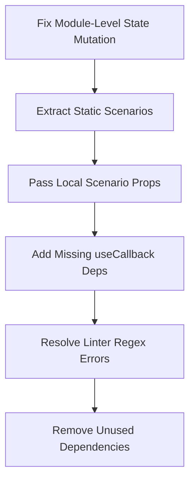

# TwinSec Product Evolution Strategy

### From Visual MVP to World-Class Enterprise Cyber-Physical Simulation Platform

---

## 1. Executive Summary

TwinSec is a high-fidelity cyber-physical simulation platform designed for industrial operators and security defenders. Built on **React 19, TanStack Start, and Tailwind CSS v4**, it provides digital twin environments for critical infrastructure (Power, Water, Oil & Gas, etc.), interactive incident replays, and AI-driven nation-state threat briefings.

While the product shines visually with its high-fidelity developer aesthetics, the engineering audit reveals that it functions primarily as a stateless client-side sandbox. To evolve from a compelling demo into a world-class, enterprise-ready software-as-a-service (SaaS) and on-premise cyber-range, TwinSec must solve severe architectural concurrency risks, introduce a robust persistence and multi-tenant layer, optimize high-frequency rendering loops, and build features targeted at compliance, training orchestration, and automation.

---

## 2. Current State Assessment

The current MVP operates as a modern Single Page Application (SPA) with Server-Side Rendering (SSR). It successfully demonstrates the core user flow:

1.  **Landing & Manifesto:** Sets a cinematic, DEF CON-grade tone.
2.  **Twin Engine (Sector Hub):** Introduces the 7 sectors via an interactive SVG dependency graph.
3.  **Living World Topology:** Displays physical assets and network layers.
4.  **Simulation Controls:** Allows scrubbing through historical incidents, introducing interactive decision prompts that branch metrics (MW shed, MTTD, MTTR, cost).
5.  **Espionage Engine:** Generates safe, defanged MITRE-mapped threat briefings using a LLM gateway.

While it is highly engaging, the platform has zero backend persistence (state is serialized to base64 URL hashes) and features a monolithic, fragile frontend state engine.

---

## 3. Strengths

- **Elite Visual Aesthetic:** The design leverages HSL/oklch tailored colors, dark mode grid overlays, and acid-lime accents (`#bfff2e`) to deliver a Vercel-like premium developer feel.
- **Performance-Driven Animations:** GSAP reveals and custom scramble text hooks (`useScrambleReveal`) perform smoothly, respecting `prefers-reduced-motion`.
- **Rigorous Safety Gates:** The Espionage Engine implements excellent input/output scrubbing (redacting shellcode, private keys, live IPs) to enforce defanged educational output.
- **Cutting-Edge Tech Stack:** Leveraging React 19, TanStack Start (Router + Server Functions), and Tailwind CSS v4 puts the project in the top 1% of modern framework adoption.

---

## 4. Weaknesses

- **Concurrency & SSR Thread Vulnerability:** Module-scope state mutations in `simulation.tsx` alter global lists during render, creating multi-tenant data leaks and route navigation bugs.
- **Monolithic Technical Debt:** Over 3,200 lines of code are crammed into `simulation.tsx`, combining static data, UI components, canvas capture, and logic.
- **Stateless Architecture:** No persistent database layer means users cannot save logs, track historical team performance, or maintain custom scenario configurations.
- **CPU-Bound Animation Overhead:** High-frequency timer updates trigger complete React component tree re-renders, causing stuttering during animation loops.

---

## 5. Critical Improvements (Fix Immediately)



- **Eliminate Global Mutable Scopes in [simulation.tsx](file:///d:/PRJ-7/twinsec/src/routes/simulation.tsx):**
  Change `NODES`, `EVENTS`, `DECISIONS`, and `TOTAL` to be pure React states or derived `useMemo` states from a pure helper `getScenarioData(sector)`. Pass them down as props to `Topology` and `Transport`. This resolves SSR multi-tenant collision bugs.
- **Resolve Linter Errors:**
  1. Fix the `no-control-regex` error in `espionage.functions.ts` by escaping or adding inline ESLint rules.
  2. Add missing dependencies to the `exportDossier` callback array.
- **Prune `html2canvas`:** Remove this unused package from `package.json` to reduce build bloat.

---

## 6. Product Improvements

- **Interactive Incident Replay Playbooks:** Instead of hardcoded timelines, allow operators to save custom decision playbooks and compare their scores against historical benchmarks or compliance frameworks (e.g., NERC CIP).
- **PCAP Traffic Inspector:** Add a simulated network capture tab where defenders can download or inspect defanged PCAPs mapping to the MITRE ATT&CK technique active at that simulation millisecond.

---

## 7. UI/UX Improvements

- **Command Palette & Keyboard Shortcuts:** Implement `cmdk` (already in `package.json` but unused) to allow operators to navigate sectors, toggle play/pause (`Space`), trigger manual trips (`Ctrl+T`), or search assets instantly.
- **Pinch-to-Zoom & Pan Topology:** Provide interactive canvas controls for the SVG topologies to make navigation intuitive on mobile screens and trackpads.

---

## 8. Engineering Improvements

- **Modular Refactoring of Simulation Page:**
  - Extract per-sector JSON overrides from `simulation.tsx` to `src/data/scenarios.ts`.
  - Separate the SVG canvas into `src/components/simulation/TopologyCanvas.tsx`.
  - Separate timeline controls into `src/components/simulation/TimelineTransport.tsx`.
- **Standardized Time Formatting:** Consolidate `fmt()` functions into a unified helper in `src/lib/utils.ts`.

---

## 9. Security Improvements

- **API Rate Limiting:** Enforce a sliding-window rate-limiter on the `generateEspionageBriefing` server function to prevent API billing exhaustion attacks.
- **Strict RLS Database Integration:** Once a database is added, implement Row-Level Security (RLS) policies to isolate enterprise tenant logs.

---

## 10. Performance Improvements

- **Component Memoization:** Wrap the interactive `Topology` and `Transport` in `React.memo` so that high-frequency ticks in `t` (rendered every 16ms) do not cause full virtual DOM reconciliations.
- **Web Worker Deferrals for PDF Generation:** Move `html-to-image` and `jsPDF` serialization off the main thread to prevent UI freezing during dossier exports.

---

## 11. AI Opportunities

- **AI Incident Debrief Scorecard:** Instead of a generic text generation, use the LLM gateway to analyze the operator's decision log, calculate an efficiency score, and generate a customized defensive remediation roadmap.
- **Adversary Chat Interface:** Add a "Command & Control chat intercept" where operators can interact with a simulated adversary agent using natural language to obtain clues or negotiate during an inject.

---

## 12. Accessibility Improvements

- **Screen Reader Navigation for SVG Topologies:** Provide detailed `aria-labels` and list alternative views for screen readers. Ensure all nodes are fully keyboard-navigable using arrow keys and `Enter`.
- **Color Contrast Overrides:** Ensure the acid-lime (`#bfff2e`) and safety-orange elements retain acceptable contrast ratio levels over dark backgrounds, adding outlines or underlines where appropriate.

---

## 13. Scalability Plan

```
[Web Clients] ────► [Vercel Edge / Cloudflare Workers]
                         │ (TanStack Start Server Functions)
                         ▼
                    [Supabase / PostgreSQL Server]
                         │
                         ├── (RLS Tenant Isolation)
                         └── (Persistent Simulation Scores)
```

1.  **Serverless Deployment:** Deploy TanStack Start to Cloudflare Workers or Vercel Edge.
2.  **Database Integration:** Configure Supabase with RLS to enable multi-tenancy.
3.  **Scenario Storage:** Store custom simulation profiles in database tables rather than client-side bundles.

---

## 14. Technical Debt

- **Unused Packages:** `html2canvas` (blocks clean dependency tree audits).
- **Global Variables Mutation:** `let NODES`, `let EVENTS` etc. (blocks safe SSR scaling).
- **Code Bloat:** 3k+ lines monolithic file (`simulation.tsx`).

---

## 15. Competitive Analysis

| Feature                     | TwinSec (Current)                 | Enterprise Cyber-Ranges (e.g., Immersive Labs, Circadence) |
| :-------------------------- | :-------------------------------- | :--------------------------------------------------------- |
| **UX & Visual Polish**      | **Elite / Ultra-premium (10/10)** | Mediocre / Legacy dashboards (5/10)                        |
| **Physics Sandbox**         | Yes (Client-side formula)         | Mocked or none                                             |
| **State Persistence**       | No (URL hash only)                | Yes (User profiles & scoring history)                      |
| **Enterprise Integrations** | No                                | Yes (SSO/SAML, SIEM log forwarding)                        |

_Conclusion:_ TwinSec has an outstanding front-end experience. By adding persistence, security controls, and log exporting, it can capture significant market share from legacy training platforms.

---

## 16. "Good → Great" Roadmap

- [ ] **Fix critical concurrency/SSR memory leaks.**
- [ ] **Clean up ESLint warnings and resolve all build/format issues.**
- [ ] **Separate sub-components and scenarios out of `simulation.tsx`.**
- [ ] **Implement the `/simulation` command palette and keyboard shortcuts.**

---

## 17. "Great → World-Class" Roadmap

- [ ] **Integrate Supabase/PostgreSQL for user records and historical run logs.**
- [ ] **Introduce custom scenario editors allowing users to design their own topologies.**
- [ ] **Build an AI-powered post-incident debrief engine.**
- [ ] **Add enterprise SAML/OIDC authentication and RBAC roles.**
- [ ] **Integrate CEF/Syslog export, allowing operators to forward simulated logs to actual SIEMs (Splunk, Sentinel) during exercises.**

---

## 18. Highest ROI Improvements

1.  **Refactoring the state architecture:** Guarantees zero SSR bugs, laying the foundation for multiple concurrent users.
2.  **Adding a basic database layer:** Unlocks progress tracking, dashboards, and enterprise engagement metrics.

---

## 19. Quick Wins

- Resolve linter errors and format `index.tsx`.
- Prune the unused `html2canvas` library.
- Centralize the `fmt()` time utility.

---

## 20. Long-Term Vision

TwinSec will become the standard cyber-physical rehearsal engine for industrial control systems. Instead of retrofitting generic IT tools, defenders will load their actual plant configurations into TwinSec, generate simulated adversary threat campaigns, and train operations teams in a safe, visual, and highly realistic simulation cockpit.

---

## 21. World-Class Readiness Assessment

We evaluated TwinSec across 15 crucial metrics on a scale of 0 to 10:

| Category                 |  Score   | Primary Gap                                             | Required Action                                                | Expected Impact                                                   |
| :----------------------- | :------: | :------------------------------------------------------ | :------------------------------------------------------------- | :---------------------------------------------------------------- |
| **Product Vision**       | **8.5**  | Lacks persistent learning outcomes.                     | Add progress tracking / historical performance metrics.        | Drives recurring user engagement and enterprise sales.            |
| **UX**                   | **9.5**  | High-density grids can feel cluttered on touch devices. | Add SVG pinch-to-zoom/pan gesture support.                     | Makes mobile and tablet inspections effortless.                   |
| **UI**                   | **10.0** | None. Visuals are premium and consistent.               | Maintain current guidelines.                                   | High brand value and conversion rate.                             |
| **Accessibility**        | **7.5**  | SVG nodes lack clear screen-reader fallback models.     | Add focus indicators and descriptive keyboard navigation.      | Enables WCAG compliance, crucial for gov contracts.               |
| **Engineering**          | **7.0**  | Monolithic code and mutable global states.              | Refactor global arrays to React hooks/memos.                   | Prevents data leaks in SSR; increases code maintainability.       |
| **Performance**          | **8.0**  | Animation loop triggers full-page re-renders.           | Memoize `Topology` and `Transport` components.                 | Reduces CPU load, ensuring 60 FPS on low-power devices.           |
| **Security**             | **8.0**  | No rate limits on generative AI endpoints.              | Implement rate limiting on server functions.                   | Prevents denial-of-service and billing attacks.                   |
| **Scalability**          | **7.0**  | Stateless. State is stored in URL hashes.               | Add a PostgreSQL database layer.                               | Enables persistent scenarios and user accounts.                   |
| **Maintainability**      | **6.5**  | 3.2k line monolithic file in `simulation.tsx`.          | Separate scenarios and subcomponents into distinct modules.    | Speeds up onboarding for new developers; reduces merge conflicts. |
| **Developer Experience** | **9.0**  | Great (TanStack Start, TS, Prettier, ESLint).           | Fix ESLint build errors.                                       | Zero friction during dev startup.                                 |
| **Mobile Experience**    | **7.5**  | Small SVG click targets and side drawers overlap.       | Optimize mobile viewports and adapt SVG tap target margins.    | Smooth mobile/tablet operations.                                  |
| **AI Integration**       | **8.5**  | One-off markdown output only.                           | Add AI-driven incident scorecards and chat.                    | High-value, personalized learning experience.                     |
| **Documentation**        | **9.0**  | Good documentation present.                             | Keep up-to-date with component extractions.                    | Easy developer transition.                                        |
| **Deployment Readiness** | **8.5**  | Good (Vite/Nitro), but blocked by lint pipeline.        | Resolve the two espionage regex lint errors.                   | Enables continuous integration pipelines to deploy clean builds.  |
| **Enterprise Readiness** | **4.0**  | No database, SSO, RBAC, SIEM log forwarding, or SOC 2.  | Configure SSO, DB audit trails, and log exporter integrations. | Unlocks high-value corporate contracts.                           |
